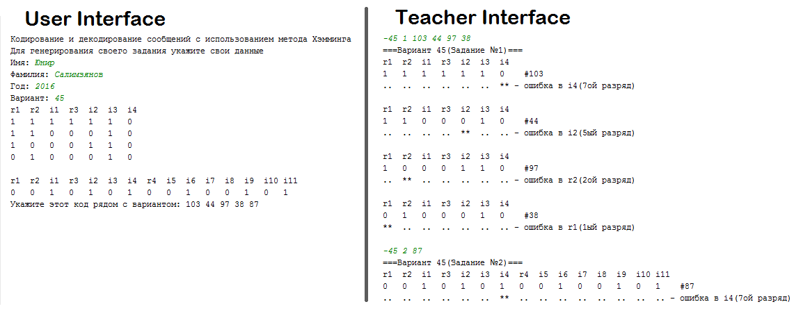

## Synopsis
This application was developed to ease up practice teacher's duty to check all students works. 

### User application 
**Input**:
* Name
* Surname
* Current year
* Variant

**Output**:
* 5 tasks

### Teacher application
**Input**: `-variant task_type [task_nums]...` 

**Output**: answers for that variant tasks

There are two **task types**: for 7 bits and for 15 bits

## Preview

